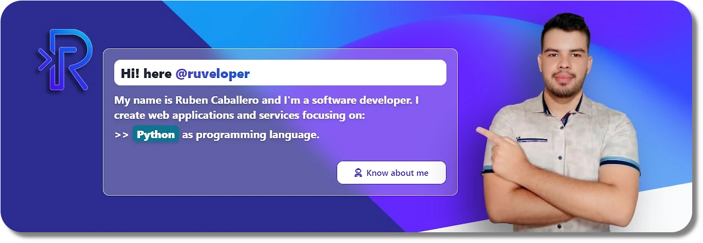

## Additionally:

- 🌱 I'm constantly growing in Backend Development.
- 📱 I'm Flutter enthusiast.
- 💖 Love 🎧🎮🏍 and automating tasks with Python.

## Main Technologies:

 

 

 

## Latest Projects:

<!-- LATEST-PROJECTS-LIST:START -->
## Latest Projects:
<table style="width:100%">
<tr>
<td>
 <a href="https://vims.ruveloper.dev/">
 
 
    

 </a>
</td>
<td>
 <a href="https://dxchat.ruveloper.dev/">
 
 
    

 </a>
</td>
<td>
 <a href="https://www.ruveloper.dev/">
 
 
   

 </a>
</td>
</tr>
<tr>
<td colspan="3">
<a href="https://www.ruveloper.dev/projects/">

<strong>EXPLORE PROJECTS</strong>

</a>
</td>
</tr>
</table>

[Bot] Projects updated on 07-22-2025

<!-- LATEST-PROJECTS-LIST:END -->
